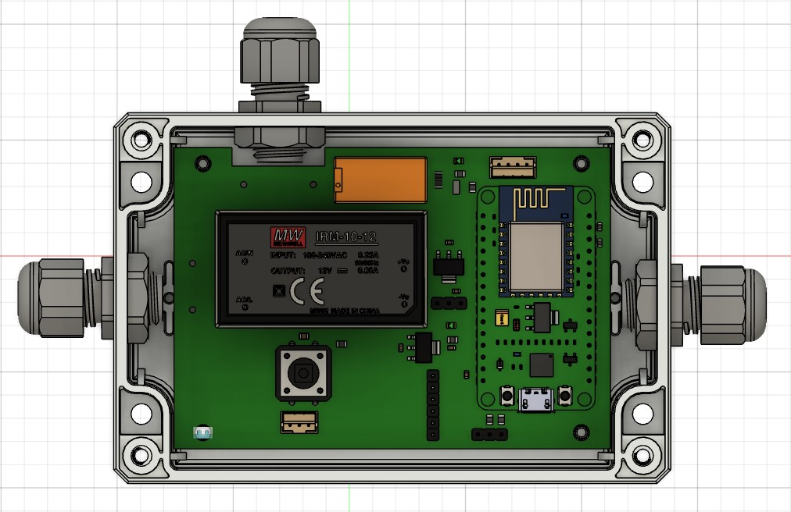
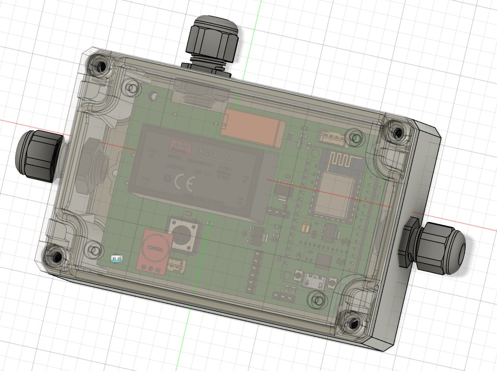
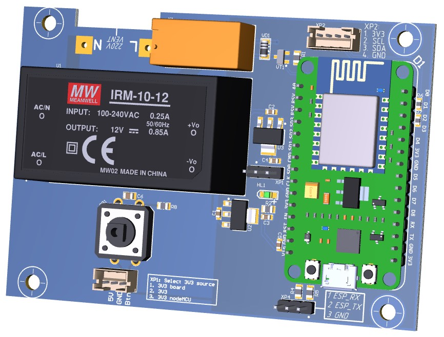
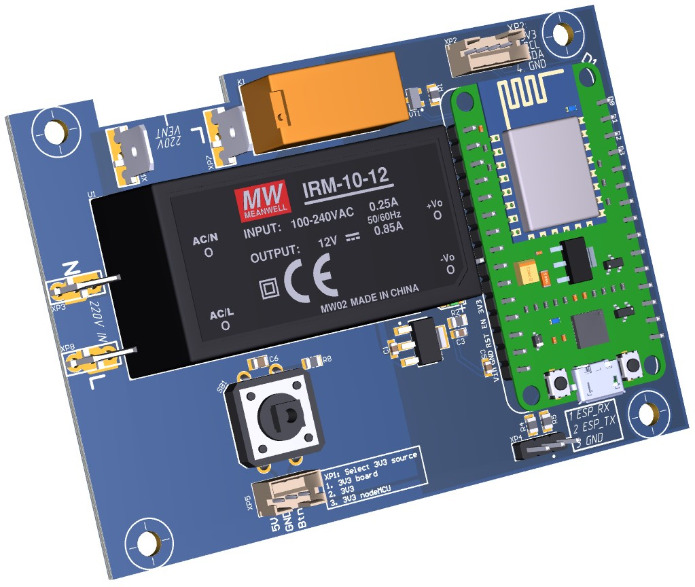
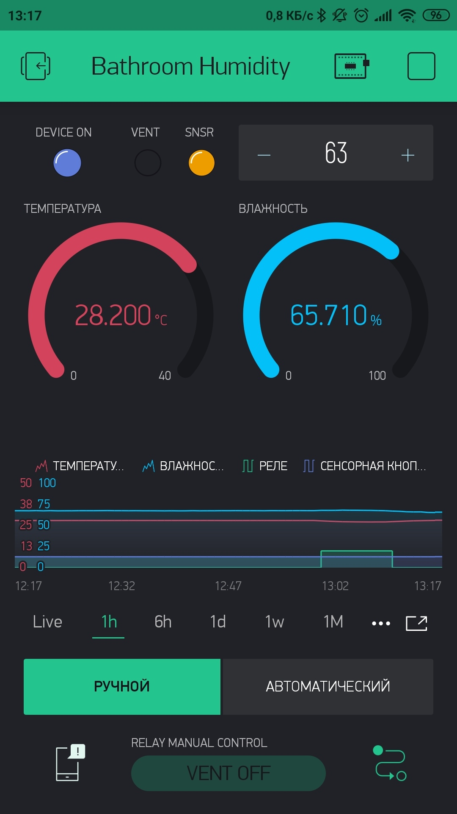

# BathVC-Project
Bathroom ventilator controller project.

This project was designed to control the exhaust fan in my bathroom.

The main task is to start the fan when the humidity level is exceeded, which is set in the app on your phone.
At the same time, information about the humidity level, temperature, and fan status (on or off) is transmitted to the phone.

A fan is a device that operates on a 220V 50-60Hz network.
Since it is necessary to switch a high-voltage device, I developed a printed circuit Board for this purpose, 
which implements a high-voltage load control scheme by switching a relay.

The ESP8266 NodeMCU Board was chosen as the MAIN device, because it is WiFI MCU with enouth free pins for this task.
SHT31-d is selected as the humidity sensor.
The user interface is designed on Blink, due to the simplicity of organizing communication between the NodeMCU card and the phone.

//--------------------------------------------------------------------------------------------------------------------------//

 
 //--------------------------------------------------------------------------------------------------------------------------//

 Lower I want to show PCB boards models. There was designed 2 versions: one was clemmas, and one with soldering pads for connect AC and Load 
 with device.

//--------------------------------------------------------------------------------------------------------------------------//

//--------------------------------------------------------------------------------------------------------------------------//

Work example of Blynk APP show below.

The ESP8266 firmware and Arduino IDE settings are located in the firmware folder.
In the folder there are 2 pcb3dViews PDF file to view the versions of boards in 3D.

//--------------------------------------------------------------------------------------------------------------------------//

Данный проект был разработан для упралвения вытяжным вентилятором в моей ванной.

Основная задача - запускать вентилятор при превышении уровня влажности, который задаётся в приложении на телефоне.
В то же время на телефон передаётся информация об уровне влажности, температуре и состоянии вентилятора (включен и выключен).

Вентилятор - устроство, работающее от сети 220В 50-60Hz.

Поскольку необходимо коммутировать высоковольтное устройство, то для этих целей мной была разработана печатная плата, 
на которой реализована схема управления высоковольтной нагрузкой посредством коммутации реле.  

В качестве основного устройства была выбрана плата ESP8266 в исполнении NodeMCU, так как поддерживает работу по WiFI и обладает
достаточным количеством свободных пинов для решения поставленной задачи.
В качестве датчика влажности выбран SHT31-D.
Интерфейс пользователя разработан на Blynk, ввиду простоты организации связи между платой NodeMCU и телефоном.

Прошивка ESP8266 и настройки ArduinoIDE расположены в папке firmware.
В папке pcb3dViews находятся 2 PDF файла для просмотра версий плат в 3D.
